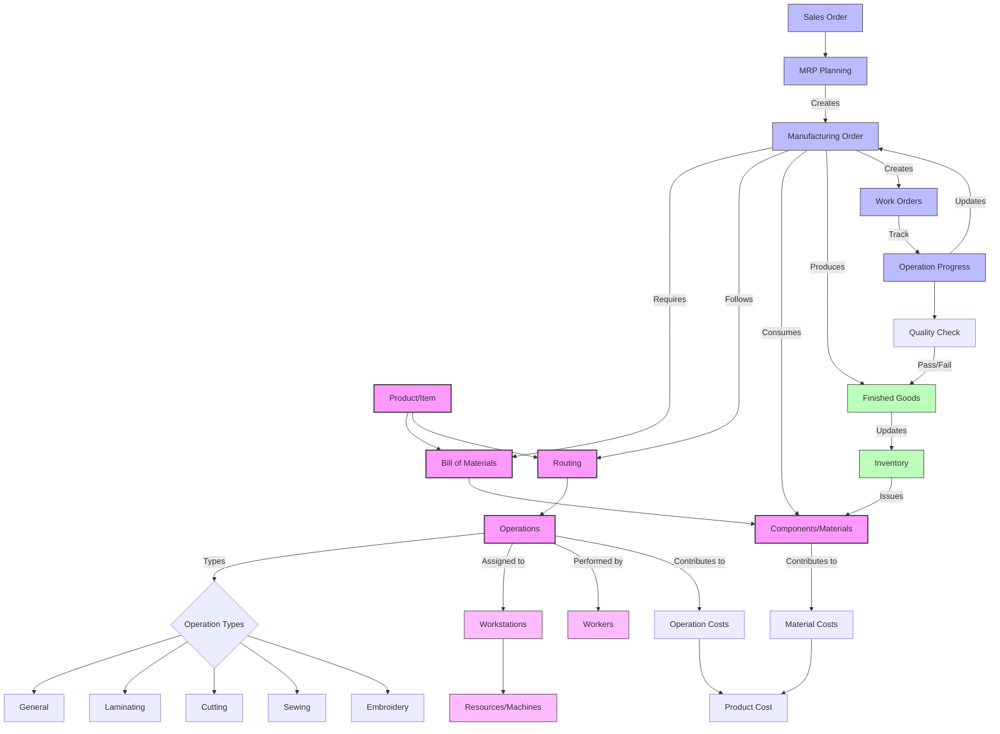

# Manufacturing Workflow Diagram

## Simplified Manufacturing Workflow Explanation

1. **Product Definition**
   - Each product has a **Bill of Materials (BOM)** listing all required components
   - Each product has a **Routing** defining the sequence of operations needed to manufacture it

2. **Planning Process**
   - **Sales Orders** trigger demand
   - **MRP Planning** calculates material requirements and production needs
   - **Manufacturing Orders** are created to produce products

3. **Production Process**
   - **Manufacturing Orders** follow the routing defined for the product
   - Each **Operation** (General, Laminating, Cutting, Sewing, Embroidery) is performed at designated **Workstations**
   - **Components** are pulled from **Inventory** as needed
   - Operations are tracked through **Work Orders** and **Operation Progress** updates

4. **Resource Management**
   - **Workstations** represent production areas or machines
   - **Operations** are assigned to specific workstations
   - Workers perform operations according to their skills and availability

5. **Inventory Flow**
   - Raw materials and components are consumed
   - Finished goods are produced and added to inventory
   - Transfers between divisions may occur for vertically integrated processes

6. **Costing**
   - Material costs are tracked
   - Operation costs (labor, machine time) are recorded
   - Combined to calculate total product cost

This workflow represents a typical manufacturing process flow in an MRP system with special emphasis on Zervi's custom operations of Laminating, Cutting, Sewing, and Embroidery.
